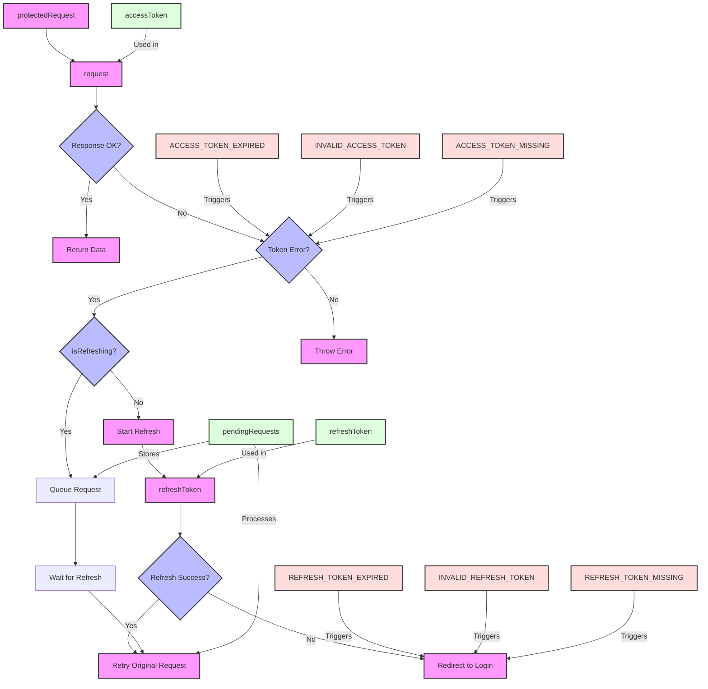
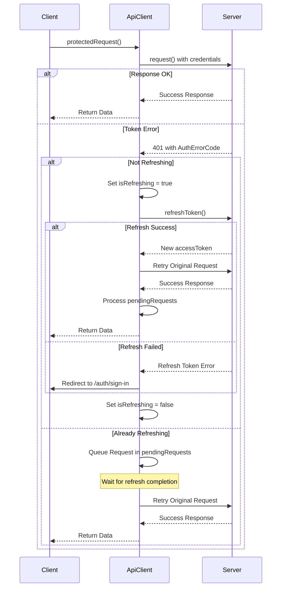

# Protected Request Logic

This document explains how the protected request system works with access and refresh tokens in our application.

## Overview

The `protectedRequest` method in `ApiClient` handles authenticated API requests with automatic token refresh. Here's how it works:

## Flow Diagram



## Sequence Diagram



## Step-by-Step Explanation

1. **Initial Request**

   - When `protectedRequest` is called, it first attempts the request normally
   - The request includes credentials automatically via `credentials: "include"`

2. **Token Error Handling**

   - If the request fails with token-related errors:
     - ACCESS_TOKEN_EXPIRED
     - INVALID_ACCESS_TOKEN
     - ACCESS_TOKEN_MISSING
   - The system checks if a refresh is already in progress

3. **Refresh Token Process**

   - If no refresh is in progress:
     - Sets `isRefreshing = true`
     - Attempts to refresh the token
     - On success, retries the original request
     - Processes any queued requests
     - Finally sets `isRefreshing = false`
   - If a refresh is already in progress:
     - Queues the current request in `pendingRequests`
     - Will be processed after the refresh completes

4. **Error Scenarios**
   - If refresh token is invalid/expired/missing:
     - User is redirected to `/auth/sign-in`
   - Other errors are thrown normally

## Example Usage

```typescript
// Making a protected request
const userProfile = await apiClient.getUserProfile();
```

## Key Features

- Automatic token refresh with request queuing
- Proper error handling with specific error codes
- Automatic redirect to login when needed
- Credentials included in all requests
- Singleton instance for consistent state management

## Important Notes

- All protected requests should use the `
